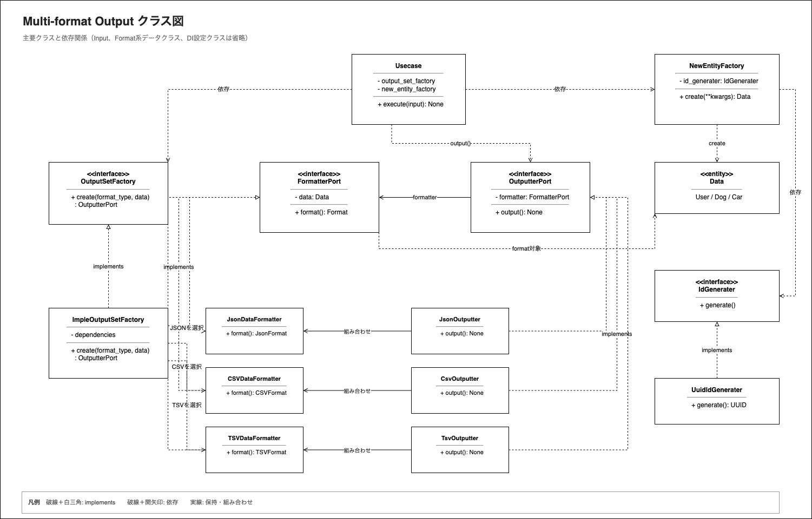

# Multi-format Output

## テーマ

複数種類のデータを、Clean Architectureに基づいて異なるフォーマットや出力先へ出力できるようにします。

JSON、CSV、TSVでは、データの変換方法や具体的な出力処理が異なります。この違いを具象クラスの内部に閉じ込め、利用側がフォーマットごとの実装差分を意識せず、共通の操作で出力できる構造を目指します。

利用側は出力形式を指定しますが、対応するFormatterやOutputterの選択、生成、実行方法を知る必要はありません。

## 目的

- Domain、Application、Infrastructureの責務と依存方向を意識する
- フォーマットごとに異なる変換処理を、共通のPortを通して扱う
- フォーマットと出力処理の組み合わせをFactoryに集約する
- Usecaseを具象Formatterや具象Outputterから分離する
- 出力形式ごとの実装差分をInfrastructure層に閉じ込める

## 処理の流れ

```text
入力データ
  ↓
Usecase
  ↓
Domain Entityの生成
  ↓
出力形式に対応するFormatterとOutputterの生成
  ↓
データの変換と出力
```

UsecaseはFactoryのPortに依存し、Factoryから共通のOutputter Portを受け取ります。そのため、選択された出力形式にかかわらず、Usecaseは同じ`output()`操作で処理を実行できます。

## クラス図


